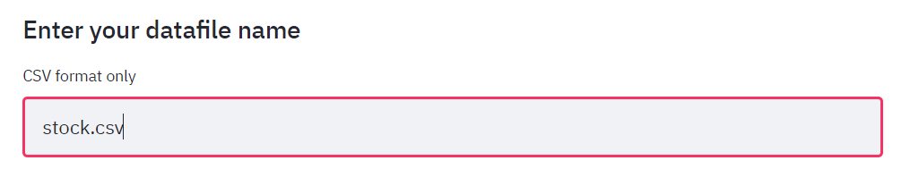
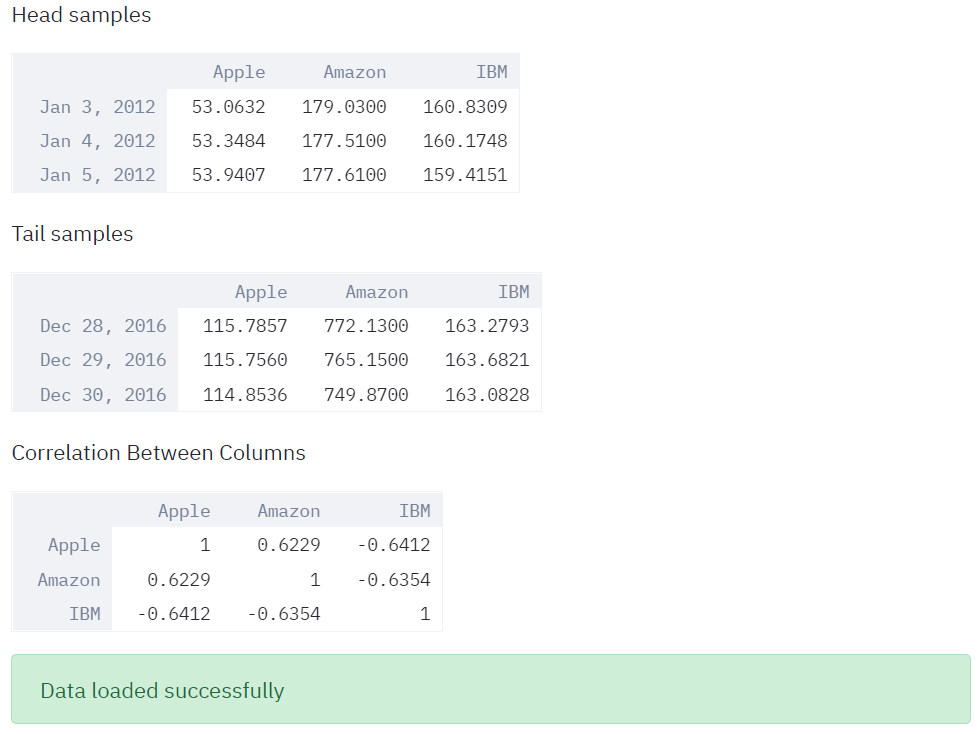
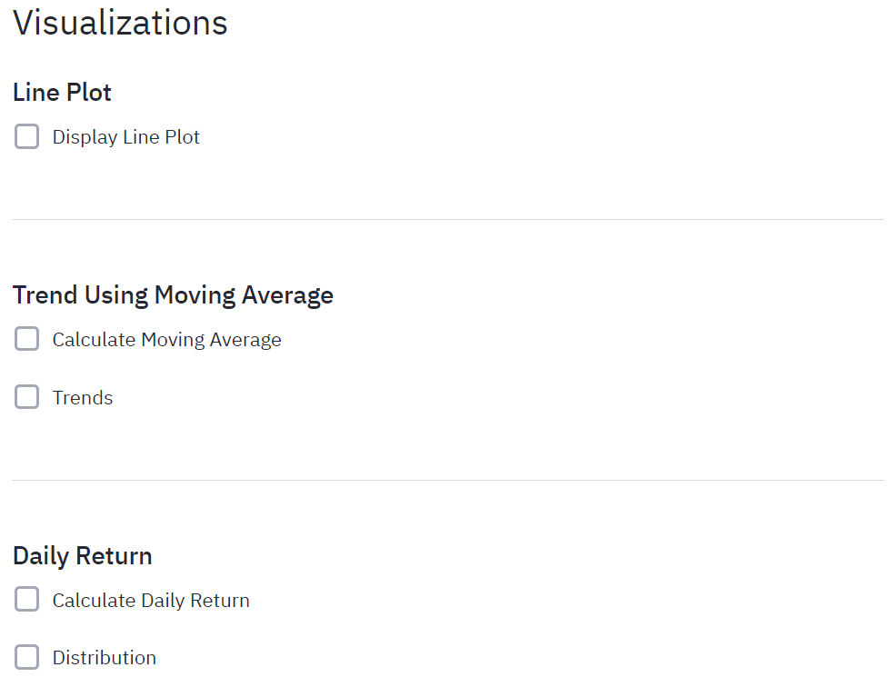
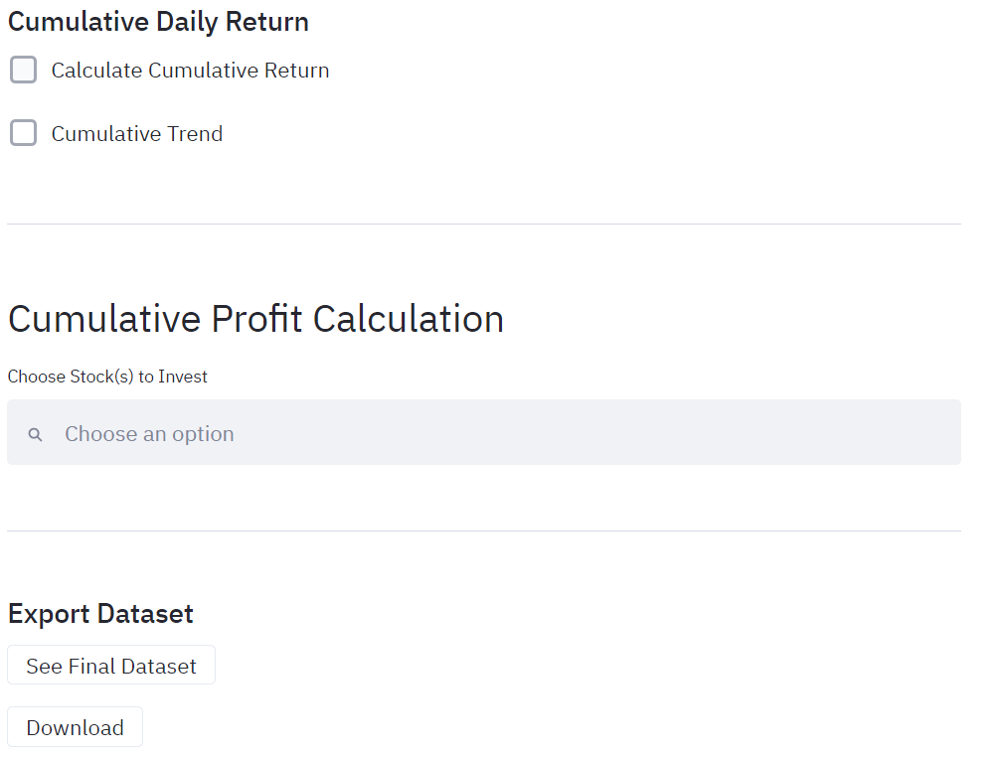

# streamlit_finance
This is a prototype of financial analysis app deployed by using streamlit. It only accepts a certain format of csv file.
In order to run the app please install the following packages:

1. pip install pandas
2. pip install streamlit
3. pip install matplotlib
4. run the py script with $streamlit run finance.py

General Overview of Finance App

